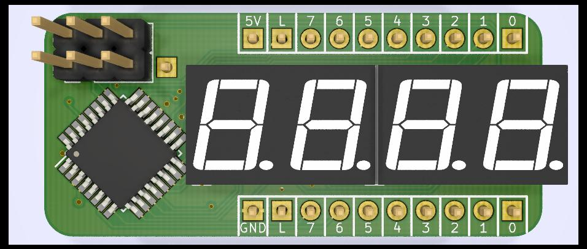
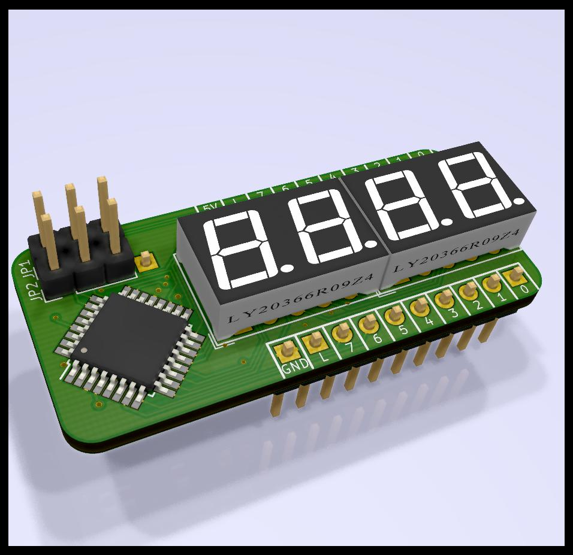

# Two-digit seven-segment HEX indicator for 8 bit values
Rev A July 2019

- ATmega328P microcontroller running at 8MHz (internal clock)
- 2 digit 7-segment display
- Configurable modes via solder jumper:
  - HEX mode (default)
    - 00-FF
  - Pseudo-decimal
    - 00-99 .99 ..55 (dot = 100)
- Unlatched (live display)

Images
============
|Front                                                 | Back                                              |
|------------------------------------------------------|---------------------------------------------------|
|||

### Schematics (pdf)
- [Complete schematics](./img/schema.pdf)

### PCB Images (svg)
- [Top](./img/pcb-front.svg)
- [Bottom](./img/pcb-back.svg)
